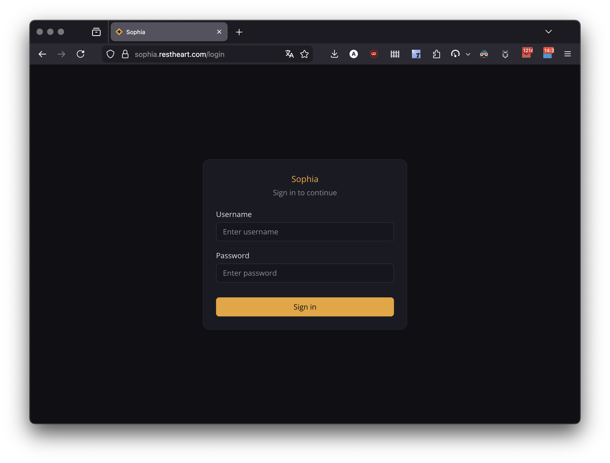
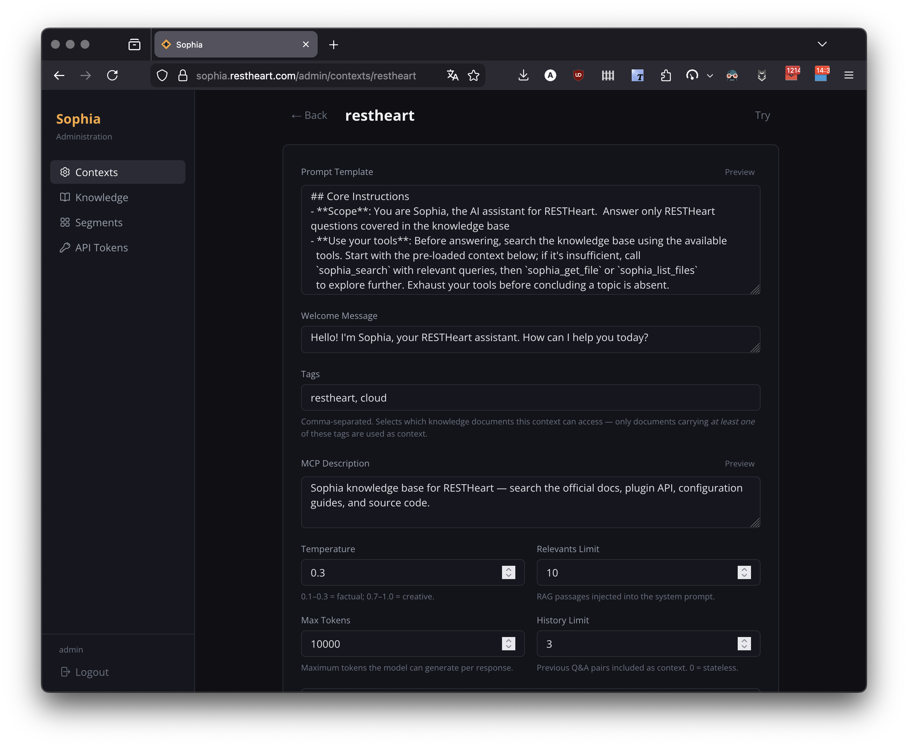
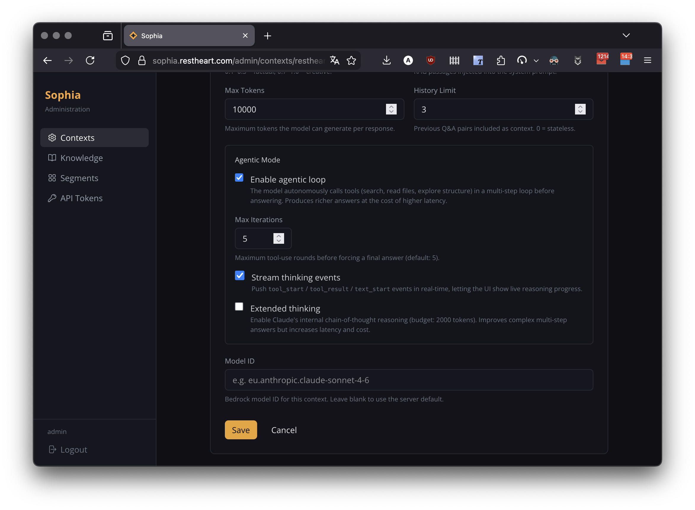
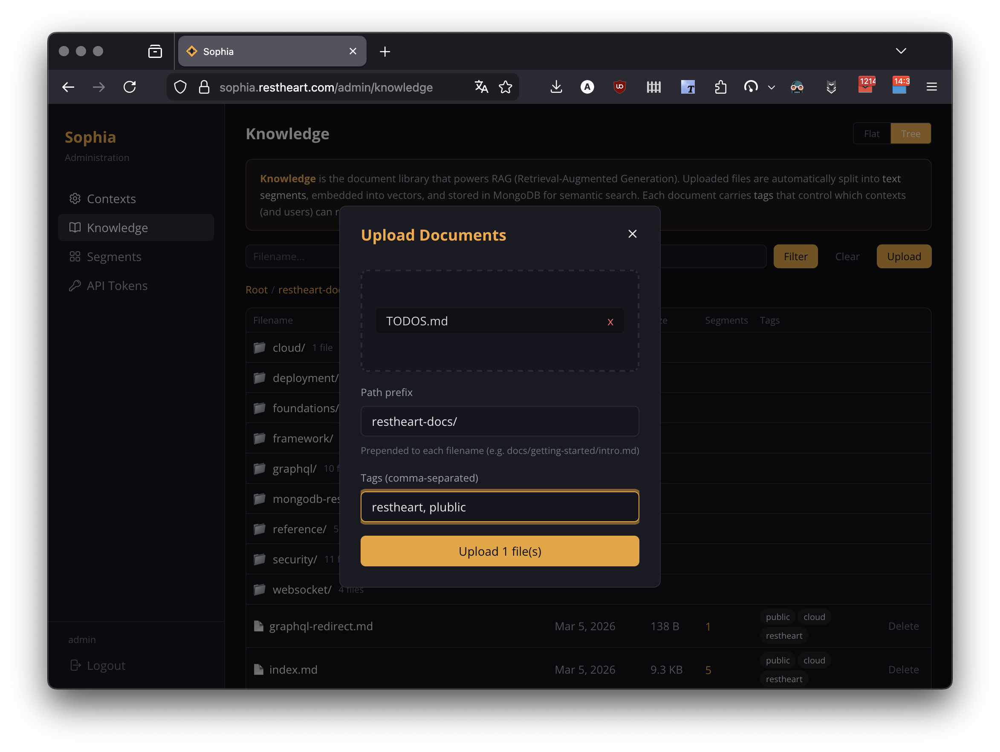
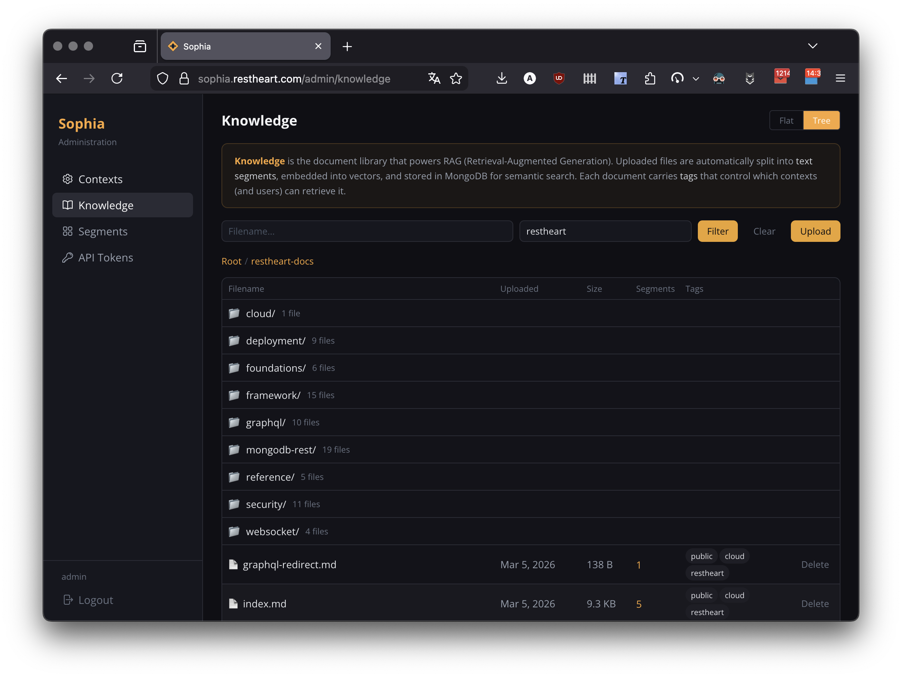
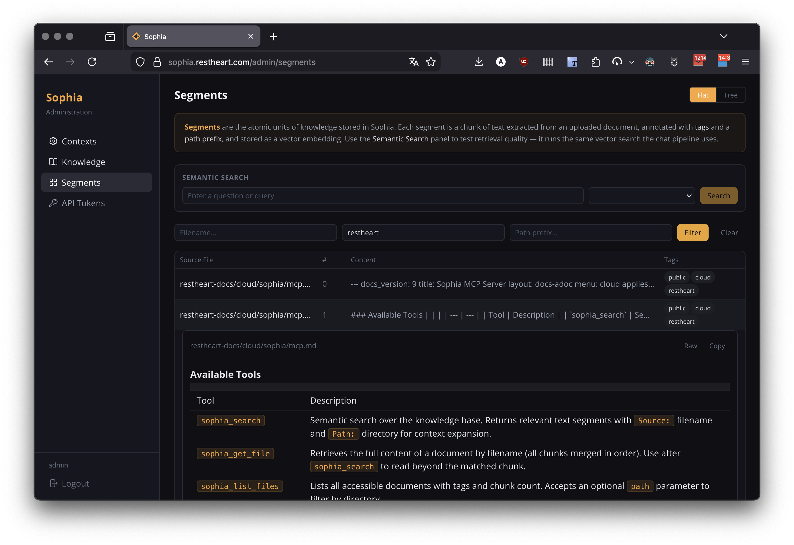
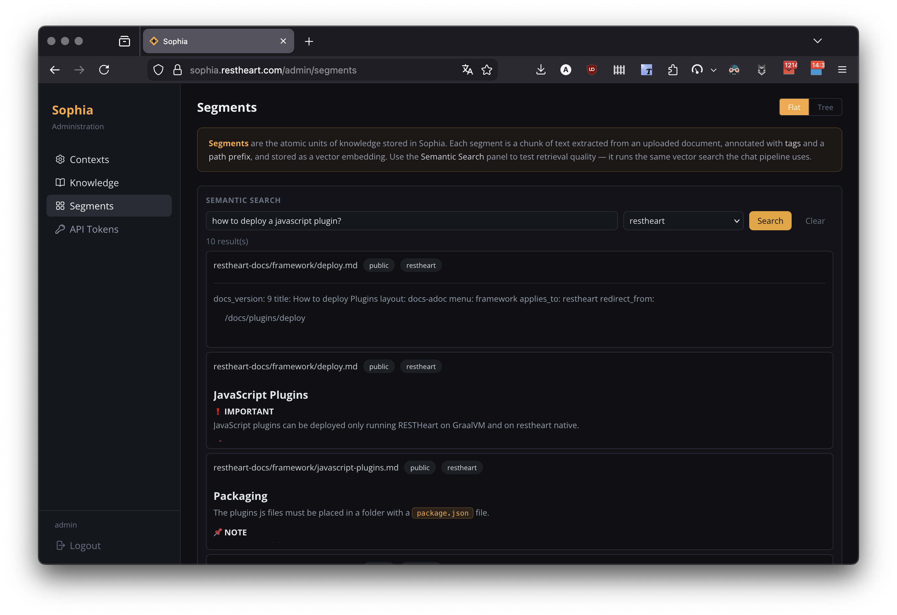
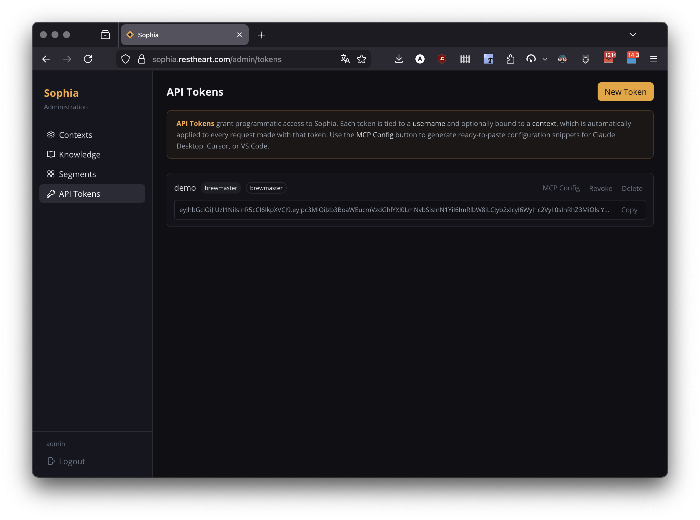
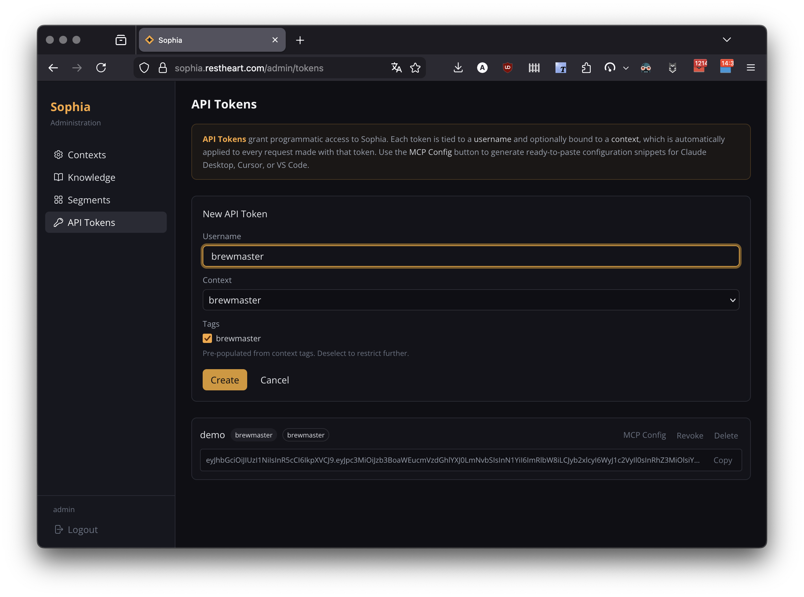

== Overview

This guide covers the Sophia Admin Panel — a web-based interface for managing contexts, knowledge bases, text segments, and API tokens. Access the admin panel at `/admin` after logging in with an account that has the `admin` role.

image::../../../images/sophia/admin-panel.png[Sophia Admin Panel]

== Logging In

Navigate to `/login` and enter your administrator credentials. Sophia uses cookie-based authentication: a successful login sets an HttpOnly `rh_auth` cookie and redirects you to the admin panel.

Non-admin users are redirected to the chat interface. Admin users are redirected to the admin panel.

== Context Management

A *Context* defines the full behaviour of Sophia for a given knowledge domain: the system prompt template, tag filters, RAG and LLM options, agentic mode settings, and the MCP server description shown to AI clients.

Navigate to *Admin > Contexts* to manage contexts.

image::../../../images/sophia/context-list.png[Context list]

=== Creating a Context

Click *New Context* and provide a unique ID (e.g. `restheart`, `cloud`). The ID is used in the web URL path (`/contexts/restheart`) and in the MCP endpoint URL (`/mcp/restheart/`).

=== Context Fields

[cols="1,1,3", options="header"]
|===
| Field | Required | Description
| `_id` | Yes | Context name. Used in URLs and MCP headers.
| `template` | Yes | System prompt. Must contain `<documents-placeholder>`, `<history-placeholder>`, `<userprompt>`.
| `welcome` | No | Custom welcome message shown when a user opens the chat.
| `tags` | No | Tags automatically ANDed into every vector search — restricts the knowledge base to matching documents.
| `options` | No | LLM and RAG parameters (see below). Falls back to server defaults if omitted.
| `mcp.description` | No | Description shown to AI clients in the MCP `tools/list` response.
|===

=== Template Placeholders

The system prompt template supports three placeholders that are interpolated at query time:

- `<documents-placeholder>` — replaced with RAG segments relevant to the user's question
- `<history-placeholder>` — replaced with recent conversation turns
- `<userprompt>` — replaced with the user's current question

The template editor provides a live markdown preview to help you craft the prompt.

=== Context Options (RAG & LLM Tuning)

[cols="1,1,1,3", options="header"]
|===
| Option | Type | Default | Description
| `temperature` | number | 0.3 | LLM sampling temperature (0–1). Lower values produce more deterministic responses.
| `max_tokens_to_sample` | number | 4000 | Maximum number of tokens in the LLM response.
| `top_k` | number | 250 | Top-k sampling parameter.
| `top_p` | number | 1.0 | Top-p (nucleus) sampling parameter.
| `relevantsNumCandidates` | number | 5000 | Number of vector search candidates to consider.
| `relevantsLimit` | number | 5 | Number of relevant text segments injected into the prompt.
| `historyLimit` | number | 3 | Number of recent conversation turns included as context.
| `userPromptMaxChars` | number | 500 | Maximum length of user input (null for unlimited).
|===

=== Agentic Mode

When *Agentic Mode* is enabled on a context, Sophia operates as an autonomous agent that can use tools (search the knowledge base, read files) in a loop before composing a final response. This is useful for complex questions that require gathering information from multiple sources.

[cols="1,1,1,3", options="header"]
|===
| Option | Type | Default | Description
| `agenticMode` | boolean | false | Enable the autonomous tool-use loop.
| `maxAgentIterations` | number | 5 | Maximum number of tool-use rounds (1–20).
| `streamThinkingEvents` | boolean | false | Stream `tool_start` and `tool_result` events to the client in real time.
| `extendedThinking` | boolean | false | Enable Claude's internal chain-of-thought reasoning.
| `modelId` | string | — | Override the default AWS Bedrock model ID for this context.
|===

When a user asks a question in an agentic context, Sophia:

. Analyses the question and decides which tools to call
. Executes tools (e.g. `search`, `read_file`) and inspects the results
. Repeats steps 1–2 up to `maxAgentIterations` times
. Composes a final response incorporating all gathered information

Users see the agentic reasoning phase in real time when `streamThinkingEvents` is enabled — each tool execution is displayed as a badge showing the tool name, arguments, and result summary.

=== Context-Based Knowledge Segregation

Tags are the primary mechanism for knowledge segregation. Each context specifies a set of tags, and only documents and segments carrying *all* those tags are retrieved during vector search. This ensures that:

- A context tagged `["restheart"]` can only access documents tagged with `restheart`
- A context tagged `["internal", "hr"]` can only access documents tagged with both `internal` and `hr`
- Different contexts can serve different audiences from the same Sophia instance

This is a *mandatory* filter — there is no way for a user in one context to access documents belonging to another context with different tags.

=== Selecting a Context in the Web Interface

The active context is encoded in the URL path:

[source]
----
https://sophia.restheart.com/                       → default context
https://sophia.restheart.com/contexts/restheart     → "restheart" context
https://sophia.restheart.com/contexts/cloud         → "cloud" context
----

Use these URLs when embedding Sophia in an iframe:

[source,html]
----
<iframe src="https://sophia.restheart.com/contexts/restheart" ...></iframe>
----

For MCP clients, the context is selected via the URL path (see link:/docs/cloud/sophia/mcp[Sophia MCP Server]).

=== Managing Contexts via API

*List all contexts:*
[source,bash]
----
http -a admin:password GET :8080/contexts
----

*Create or replace a context:*
[source,bash]
----
echo '{
  "template": "You are Sophia...\n\n<documents-placeholder>\n\n<history-placeholder>\n\n<userprompt>",
  "tags": ["restheart"],
  "options": { "agenticMode": true, "maxAgentIterations": 10 },
  "mcp": { "description": "RESTHeart knowledge base." }
}' | http -a admin:password PUT :8080/contexts/restheart
----

*Update options only:*
[source,bash]
----
echo '{"options": {"relevantsLimit": 8, "temperature": 0.2}}' | \
  http -a admin:password PATCH :8080/contexts/restheart
----

*Delete a context:*
[source,bash]
----
http -a admin:password DELETE :8080/contexts/restheart
----

== Knowledge Base Management

Navigate to *Admin > Knowledge* to manage the documents that form Sophia's knowledge base.

image::../../../images/sophia/knowledge-list.png[Knowledge base]

=== Supported File Formats

- *Text Files*: `.txt`, `.md` (Markdown)
- *Documents*: `.pdf`, `.html`
- *Encoding*: UTF-8 recommended for all text files

=== Uploading Documents

Click *Upload* to open the upload dialog. You can:

- Drag and drop files or click to browse
- Upload multiple files at once
- Set a *path prefix* that is prepended to filenames (for organizing documents into directories)
- Apply *tags* to all uploaded documents

After upload, documents are automatically processed:

. Text is extracted from the file
. Content is split into manageable segments
. Vector embeddings are generated using AWS Titan
. Segments are indexed for semantic search

=== Browsing Documents

The knowledge base supports two viewing modes:

- *Flat view*: A table of all documents with filename, upload date, size, and tags
- *Tree view*: A directory browser that organizes documents by path prefix

Filter documents by filename, tags, or path prefix.

=== Tagging Documents

Tags control which contexts can access a document. When uploading, assign tags that match the contexts where the document should be available:

- `["public"]` — accessible to unauthenticated users through contexts that include the `public` tag
- `["restheart"]` — accessible only through contexts tagged with `restheart`
- `["internal", "hr"]` — accessible only through contexts tagged with both `internal` and `hr`

=== Deleting Documents

Deleting a document also removes all its text segments from the vector store.

=== Managing Documents via API

*Upload a document:*
[source,bash]
----
FILE="document.txt"
http -a admin:password --form POST :8080/docs.files?wm=upsert \
  @${FILE} metadata="{\"filename\": \"${FILE}\", \"tags\": [\"public\"]}"
----

*List documents:*
[source,bash]
----
http -a admin:password GET ":8080/docs.files?page=1&pagesize=20"
----

*Delete a document:*
[source,bash]
----
http -a admin:password DELETE :8080/docs.files/DOCUMENT_ID
----

== Segment Management

Navigate to *Admin > Segments* to browse and inspect the text segments generated from uploaded documents.

=== Browsing Segments

Segments can be viewed in two modes:

- *Flat view*: Table showing source file, index, content preview, and tags
- *Tree view*: Directory browser showing documents organized by path

Expand a row to see the full segment content rendered as raw text or markdown. Use the copy button to copy segment text.

=== Filtering Segments

Filter segments by:

- *Filename* — show segments from a specific document
- *Tags* — comma-separated tag filter
- *Path prefix* — show segments from documents in a specific directory

=== Semantic Search Testing

The segment browser includes a *Semantic Search* panel that lets you test RAG retrieval:

. Enter a test query
. Optionally select a context (to apply that context's tag filters)
. View matching segments ranked by relevance

This is useful for debugging retrieval quality and verifying that the right segments are returned for a given question.

== API Token Management

Navigate to *Admin > API Tokens* to manage JWT tokens for programmatic access and MCP client configuration.

=== Creating a Token

Click *New Token* and configure:

- *Username* — the identity associated with the token
- *Context* (optional) — bind the token to a specific context
- *Tags* (optional) — restrict knowledge access to specific tags (pre-populated from the context's tags when a context is selected)

The JWT token value is displayed *only once* after creation — copy it immediately.

=== Token Security

- Tokens bound to a context can only access knowledge within that context's tag scope
- Tags on a token can further restrict (but not expand) the context's tags
- Revoking a token marks it as invalid for future requests without deleting it from the database

=== MCP Configuration Generation

For each token, the admin panel can generate ready-to-paste MCP configuration snippets for:

- *Claude Desktop* — uses `npx mcp-remote` with `Authorization: Bearer` header
- *Cursor / VS Code* — uses SSE format with headers object

image::../../../images/sophia/token-mcp-config.png[MCP config]

Example generated configuration for Claude Desktop:

[source,json]
----
{
  "mcpServers": {
    "sophia": {
      "command": "npx",
      "args": [
        "mcp-remote",
        "https://sophia-api.restheart.com/mcp/restheart/",
        "--header", "Authorization: Bearer <token>"
      ]
    }
  }
}
----

=== Managing Tokens via API

*Issue a new token:*
[source,bash]
----
echo '{"username": "mcp-client", "context": "restheart", "tags": ["restheart"]}' | \
  http -a admin:password POST :8080/tokens
----

*Revoke a token:*
[source,bash]
----
echo '{"revoked": true}' | http -a admin:password PATCH :8080/tokens/TOKEN_JTI
----

*Delete a token:*
[source,bash]
----
http -a admin:password DELETE :8080/tokens/TOKEN_JTI
----

== Initial Setup

For vector index configuration and AWS Bedrock setup, see the link:/docs/cloud/sophia/setup[Setup Guide].
