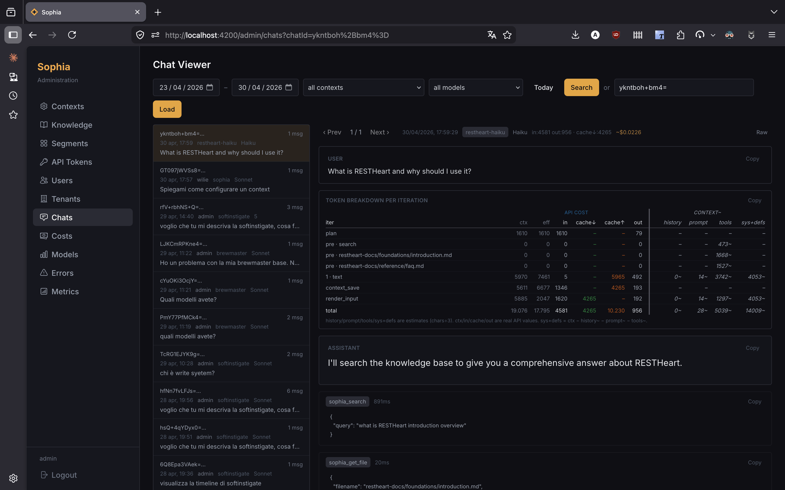
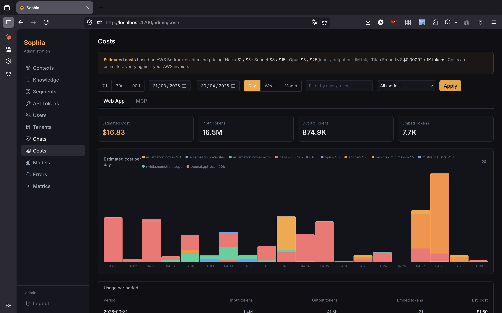

== Overview

This guide covers the Sophia Admin Panel — the web-based interface where you manage agents, knowledge bases, text segments, users, API tokens, chat sessions, costs, errors, and models. Access the admin panel at `/admin` after logging in with an administrator account.

image::../../../images/sophia/admin-panel.png[Sophia Admin Panel]

== Logging In

Navigate to `/login` and enter your credentials. Sophia uses cookie-based authentication: a successful login sets an HttpOnly `rh_auth` cookie and redirects you to the admin panel.

image::../../../images/sophia/login.png[Login page]

Non-admin users are redirected to the chat interface; administrators are redirected to the admin panel.

=== Legal Acceptance Modal

On the first login (and after any major-version bump of the Terms of Service or Privacy Policy) Sophia displays a blocking modal asking the user to accept three things:

. The current *Terms of Service* (link to the external document on restheart.com)
. The current *Privacy Policy* (link to the external document on restheart.com)
. The clauses listed in §13.5 of the Terms that, under Italian law (art. 1341 c.c.), require separate written approval

The modal cannot be dismissed without accepting or logging out — any Mongo request issued before acceptance is intercepted server-side and returns `403 AcceptanceRequired`. The acceptance record (version, URL, timestamp, IP address) is persisted on the user document under `consents`; see link:#legal-documents-and-consents[Legal Documents and Consents] below.

== Agent Management

A *Agent* defines the full behaviour of Sophia for a given knowledge domain: the system prompt template, tag filters, RAG and LLM options, agentic mode settings, collaborative artifacts, hint questions, deck view, and the MCP server description shown to AI clients.

Navigate to *Admin > Agents* to manage agents.

image::../../../images/sophia/context-list.png[Agent list]

=== Creating an Agent

Click *New Agent* and provide a unique ID (e.g. `support`, `product-docs`). The ID is used in the web URL path (`/{agentId}`) and in the MCP endpoint URL (`/mcp/{agentId}/`).

image::../../../images/sophia/context-edit.png[Agent editor]

=== Agent Fields

[cols="1,1,3", options="header"]
|===
| Field | Required | Description
| `_id` | Yes | Agent name. Used in URLs and MCP paths.
| `template` | Yes | System prompt. Must contain `<documents-placeholder>` (or use agentic context management — see below).
| `welcome` | No | Custom welcome message shown when a user opens the chat.
| `hintQuestions` | No | List of suggested questions shown as clickable chips at session start.
| `tags` | No | Tags ANDed into every vector search — restricts the knowledge base to matching documents.
| `private` | No | If `true`, requires a JWT containing this agent id in the `agents` claim. Public agents are reachable without authentication.
| `options` | No | LLM, RAG, agentic and rendering parameters (see below).
| `mcp.description` | No | Description shown to AI clients in the MCP `tools/list` response.
|===

=== Template Placeholders

The system prompt template is interpolated at query time. Use the placeholder that matches your operating mode:

- `<documents-placeholder>` — replaced with RAG segments relevant to the user's question (linear and agentic modes)
- `<history-placeholder>` — replaced with recent conversation turns. Ignored when *Agentic Context Management* is enabled.
- `<userprompt>` — replaced with the user's current question

The template editor provides a live markdown preview. The editor also displays a *cached prefix size* and a *cost-per-interaction* estimate based on the chosen model.

=== Hint Questions

Provide a newline-separated list of suggested questions. They appear as clickable chips at the start of a new chat session — clicking one sends it as the first prompt. Useful for guiding new users to common entry points.

=== Tag Filters

Tags are the primary mechanism for knowledge segregation. The agent's `tags` are ANDed with every vector search: only documents carrying *all* of the agent's tags are retrieved.

- An agent with `tags: ["restheart"]` can only access documents tagged `restheart`
- An agent with `tags: ["internal", "hr"]` can only access documents tagged with both
- This is a *mandatory* filter — users cannot bypass it

=== LLM & RAG Options

[cols="1,1,1,3", options="header"]
|===
| Option | Type | Default | Description
| `temperature` | number | `0.3` | LLM sampling temperature (0–1). Lower values produce more deterministic responses.
| `max_tokens_to_sample` | number | `4000` | Maximum tokens in the LLM response.
| `top_k` | number | `250` | Top-k sampling parameter.
| `top_p` | number | `1.0` | Top-p (nucleus) sampling parameter.
| `relevantsNumCandidates` | number | `200` | Vector search candidates considered before ranking.
| `relevantsLimit` | number | `5` | Number of relevant text segments injected into the prompt.
| `historyLimit` | number | `3` | Recent conversation turns included as context. Ignored when *Agentic Context Management* is on.
| `userPromptMaxChars` | number | `1000` | Maximum length of user input. `null` for unlimited.
| `modelId` | string | server default | Bedrock inference profile id. Pick from the *Models* table — leave blank to use the server default.
|===

The agent editor exposes these fields directly. The right-hand side shows a model picker with origin (EU/US), pricing per million input/output tokens, and a tool-use score that highlights models suited for agentic workflows.

=== Agentic Mode

Enable *Agentic Mode* on an agent to let Sophia operate as an autonomous agent: it iteratively calls tools (search, file retrieval, list-paths, list-tags) before composing a final answer.

image::../../../images/sophia/context-agentic.png[Agentic mode settings]

[cols="1,1,1,3", options="header"]
|===
| Option | Type | Default | Description
| `agenticMode` | boolean | `false` | Enable the autonomous tool-use loop.
| `maxAgentIterations` | number | `5` | Maximum tool-use rounds (1–20). Higher values cost more and take longer.
| `streamThinkingEvents` | boolean | `true` | Stream `tool_start` / `tool_result` / `text_start` events to the client in real time.
| `extendedThinking` | boolean | `false` | Enable Claude's internal chain-of-thought reasoning. Only effective on Claude models.
| `compactSearch` | boolean | `false` | Make `search` return source/chunk/preview only. ~10× cheaper than full segments.
| `searchAndFetchPreamble` | boolean | `false` | Run a deterministic search + read on the top result before the model loop, injected as iteration 0 — typically reduces total iterations from 3–4 to 1.
| `agenticContextManagement` | boolean | `false` | Replace classic history with a persistent context document keyed by `chatId`. See below.
|===

When a user asks a question in an agent with Agentic Mode, Sophia:

. Optionally runs the *Search & Fetch Preamble* (synthetic iteration 0)
. Calls tools, inspects results, decides next step
. Repeats up to `maxAgentIterations`
. Composes the final response

Users see the agentic phase in real time when `streamThinkingEvents` is on — each tool call becomes a badge with name, arguments, and result summary; expanding it reveals the full breakdown.

=== Agentic Context Management

When `agenticContextManagement` is enabled, Sophia replaces classic history injection with a *persistent markdown context document* keyed by `chatId`:

- *Start of turn*: if a saved context exists, the system auto-injects it as a synthetic `context_load` tool result before the main loop. `historyLimit` is ignored.
- *End of turn*: after the model's text answer, the system runs a separate forced call asking the model to summarise via `context_save`, `context_append`, or `context_skip`. Those tools are not available in the main loop — they are invoked only by the synthetic post-answer step.

This frees the main loop from history-token cost on every turn and keeps long-session coherence. The prompt template should *not* instruct the model to call `context_*` itself — doing so blocks the synthetic flow.

=== Collaborative Mode

Enable *Collaborative Mode* (under Agentic settings) to let the model render rich interactive HTML artifacts directly in the chat:

[cols="1,1,1,3", options="header"]
|===
| Option | Type | Default | Description
| `collaborative` | boolean | `false` | Add `show` to the agentic loop. After the model's text answer, force a `ask` call with 2–4 follow-up buttons.
| `askDesc` | string | server default | Override the description of the `ask` tool. Document domain-specific patterns.
| `showDesc` | string | server default | Override the description of the `show` tool. Document visual style and content guidelines.
|===

`show` produces HTML in an iframe injected into the chat — diagrams, calculators, mini-dashboards, REST micro-tools. PicoCSS v2 with dark theme is pre-loaded; the model can also use a `<style>` block for custom CSS.

`ask` is *not* available in the main loop. It is invoked only by the post-answer synthetic call, which constrains the model to attach 2–4 follow-up buttons. The prompt template should *not* instruct the model to call `ask` directly — doing so prevents the synthetic flow.

A per-message toggle in the chat UI lets the end user activate Collaborative Mode for a specific question, even on agents where it is off by default.

image::../../../images/sophia/chat-artifact.png[Interactive artifact rendered in chat]

=== Deck View

Set `deckView: true` to replace the linear chat layout with a horizontal deck of cards — each interaction becomes a swipeable card, prompt above, scrollable answer below. Useful for guided tours, lesson decks, and product demos.

image::../../../images/sophia/chat-deck-view.png[Deck view]

=== Selecting an Agent

The active agent is encoded in the URL path:

[source]
----
https://your-sophia-instance/                  → default agent
https://your-sophia-instance/{agent-id}      → "{agent-id}" agent
----

Use these URLs when embedding Sophia in an iframe:

[source,html]
----
<iframe src="https://your-sophia-instance/{agent-id}" ...></iframe>
----

For MCP clients, the agent is selected via the URL path (see link:/docs/cloud/sophia/mcp[Sophia MCP Server]).

=== Private Agents

Set `private: true` to require authentication. Access is granted to:

. Sessions whose JWT contains this agent's id in the `agents` claim (cookie auth or `Authorization: Bearer`)
. MCP clients using a long-lived API token issued from the *API Tokens* page
. MCP clients completing the OAuth `client_credentials` flow (Claude Desktop)

Public agents work without authentication.

=== Managing Agents via API

*List all agents:*
[source,bash]
----
http -a admin:password GET :8080/agents
----

*Create or replace an agent:*
[source,bash]
----
echo '{
  "template": "You are Sophia...\n\n<documents-placeholder>",
  "tags": ["support"],
  "options": {
    "agenticMode": true,
    "maxAgentIterations": 8,
    "compactSearch": true,
    "searchAndFetchPreamble": true,
    "agenticContextManagement": true,
    "collaborative": false
  },
  "mcp": { "description": "Customer-facing support assistant." }
}' | http -a admin:password PUT :8080/agents/support
----

*Update options only:*
[source,bash]
----
echo '{"options": {"relevantsLimit": 8, "temperature": 0.2}}' | \
  http -a admin:password PATCH :8080/agents/support
----

*Delete an agent:*
[source,bash]
----
http -a admin:password DELETE :8080/agents/support
----

== Knowledge Base Management

Navigate to *Admin > Knowledge* to manage the documents that form Sophia's knowledge base.

image::../../../images/sophia/knowledge-list.png[Knowledge base]

=== Supported File Formats

[cols="1,3", options="header"]
|===
| Category | Extensions
| Plain text & markup | `.txt`, `.md`, `.html`, `.xml`
| Office documents | `.pdf`, `.docx`, `.xlsx`, `.pptx`, `.doc`, `.xls`, `.ppt`, `.rtf`
| Open document | `.odt`, `.ods`, `.odp`
| Apple iWork | `.pages`, `.numbers`, `.key`
| eBook | `.epub`
| Source code | `.java`, `.kt`, `.py`, `.js`, `.mjs`, `.ts`, `.go`, `.rs`, `.swift`, `.cs`, `.cpp`, `.cc`, `.c`, `.h`
|===

Apache Tika handles parsing for prose formats; code-aware splitters preserve semantic boundaries (functions, classes) for source files.

=== Uploading Documents

Click *Upload* to open the upload dialog.

image::../../../images/sophia/knowledge-upload.png[Upload dialog]

The dialog supports:

- Drag-and-drop or click-to-browse, multiple files at once
- *Path prefix* — prepended to filenames for organising into directories. Auto-completes against existing directories; if the entered prefix doesn't exist yet, a banner indicates the new directory will be created.
- *Tags* — free-form, comma-separated. By default the chip "Accessible from public agents (adds `public` tag)" is on, simulating the most common case; toggle it off to make the upload accessible only to authenticated users matching the agent tags.

After upload, documents are processed automatically:

. Text is extracted via Tika or a code-aware splitter
. Content is split into segments
. Segments are embedded with Amazon Titan Embed Text v2
. Vectors are persisted in the `textSegments` collection

=== Browsing Documents

Two viewing modes:

- *Flat*: a paginated table of all documents — filename, upload date, size, segment count, tags
- *Tree*: a directory browser showing immediate children of the current path

image::../../../images/sophia/knowledge-tree.png[Tree view]

Filters: filename (`$regex` substring), tags (comma-separated, AND filter), failed-only (toggle that switches to flat view and isolates documents whose indexing failed).

=== Failed Indexing & Retry

Documents whose vectorization failed are flagged with a red ⚠ icon and a tooltip exposing the error message. A *Retry* button clears the failure flag and re-queues the document for processing. Common causes: malformed PDF, throttled embedding model, transient AWS errors.

=== Editing Tags

Hover any document row to reveal a small ✎ icon next to the tag chips: click it to inline-edit tags for a single document. Press Enter to save, Escape to cancel.

For bulk operations use *Batch Tags* in the toolbar:

[cols="1,3", options="header"]
|===
| Operation | Effect
| *Replace* | Set the given tags on all matching documents (overwrites existing tags).
| *Add* | Union the given tags with each document's existing tags.
| *Remove* | Subtract the given tags from each document's existing tags.
|===

When in tree mode the dialog operates within the current directory; an *Include subdirectories* checkbox (on by default) controls whether the operation recurses. The status text under the input shows the active scope and tag/filename filters in effect. A progress bar appears during execution.

=== Deleting Documents

Deleting a document also removes all its text segments from the vector store. Bulk delete is supported via the REST API.

=== Managing Documents via API

*Upload a document:*
[source,bash]
----
FILE="document.pdf"
http -a admin:password --form POST :8080/docs.files \
  @${FILE} \
  metadata="{\"filename\": \"${FILE}\", \"tags\": [\"public\", \"support\"]}"
----

*List documents:*
[source,bash]
----
http -a admin:password GET ":8080/docs.files?page=1&pagesize=20"
----

*Filter by directory prefix:*
[source,bash]
----
http -a admin:password GET ":8080/docs.files?filter={\"filename\":{\"\$regex\":\"^docs/\"}}"
----

*Update tags on a single document:*
[source,bash]
----
echo '{"tags": ["public", "support", "v2"]}' | \
  http -a admin:password PATCH :8080/docs.files/{file_id}
----

NOTE: For GridFS files the PATCH body is merged into the metadata subdocument — use `tags` (without the `metadata.` prefix).

*Delete a document:*
[source,bash]
----
http -a admin:password DELETE :8080/docs.files/{file_id}
----

== Segment Management

Navigate to *Admin > Segments* to inspect the text segments generated from uploaded documents.

image::../../../images/sophia/segment-list.png[Segment list]

=== Browsing Segments

Two viewing modes (flat / tree). Each row shows source file, segment index, content preview, and tags. Expand a row to see the full segment rendered as raw text or markdown; a copy button copies the segment text.

=== Filtering

- *Filename* — show segments from a specific document
- *Tags* — comma-separated AND filter
- *Path prefix* — show segments from documents in a directory subtree

=== Semantic Search Testing

The *Semantic Search* panel lets you test RAG retrieval directly against the knowledge base:

. Enter a test query
. Optionally select an agent to apply that agent's tag filters
. View matching segments ranked by score

image::../../../images/sophia/segment-search.png[Semantic search]

Useful for tuning `relevantsLimit`, debugging missing-document issues, and verifying tag filters.

== User Management

Navigate to *Admin > Users* to manage user accounts. Each account authenticates with a username and password, and carries a list of *roles* and *agents*.

[cols="1,3", options="header"]
|===
| Role | Capability
| `user` | Default role for end users — can chat against agents whose id is in the user's `agents` claim, or any public agent.
| `tenant-admin` | Manages every resource (agents, knowledge, users, tokens) belonging to their own tenant. Cannot reach other tenants' data. See link:#multi-tenant-isolation[Multi-tenant Isolation].
| `admin` | Global administrator — manages every tenant and every resource. Required for managing the `tenants` collection.
|===

Account properties:

- `_id` — username; must be a valid email address (lowercased). Immutable after creation.
- `password` — hashed automatically (bcrypt) on write. Strength is enforced server-side by `mongoRealmAuthenticator.enforce-minimum-password-strenght` (score ≥ 3 on zxcvbn).
- `roles` — array of roles
- `agents` — list of agent ids the user is explicitly authorised for. Required for accessing *private* agents; public agents are reachable without listing.
- `tags` — optional knowledge restriction; if set, the user can only retrieve documents carrying at least one of these tags
- `tenant` — the tenant the user belongs to (mandatory for `tenant-admin` and `user`; the global `admin` typically has no tenant)
- `consents` — record of accepted Terms of Service, Privacy Policy and art. 1341 c.c. clauses. Populated automatically by the legal-acceptance flow. See link:#legal-documents-and-consents[Legal Documents and Consents].

A user can change their own password (from the link:#user-profile-page[Profile] page) but not their roles, tenant or agents. Only an administrator can grant/revoke roles.

=== Multi-tenant Isolation

A `tenant-admin` sees only resources whose `tenant` field equals their own. The isolation is enforced via RESTHeart's `mongoAclAuthorizer` (`readFilter` + `writeFilter` + `mergeRequest`) and complemented by server-side interceptors for documents that the backend creates on behalf of the user (chats, segments, MCP sessions, API tokens).

To create a new tenant: open *Admin > Tenants* as a global `admin`, click *New Tenant*, and assign a tenant administrator. The global admin remains responsible for tenant CRUD; tenant-admins cannot manage tenants other than their own.

=== User Profile Page

Every authenticated user (regardless of role) has access to `/profile` — a single self-service page exposing:

- *Account* — email (= `_id`), tenant, roles, status, "member since"
- *Accessible Agents* (collapsible) — list of agents the user can chat with, badged `public` or `private`
- *Change Password* (collapsible) — form to change the user's own password; the current password is re-verified before the change is committed (UX hardening against session hijack)
- *Accepted Policies* — version + date of accepted Terms / Privacy / Cookie policy, with a "re-acceptance required" badge when an outdated version is detected
- *Session* — explicit Logout button (centralized; the avatar dropdown and admin sidebar link to this page rather than logging out directly)

Administrators reach the page from the *Profile* link in the admin sidebar; regular users via the avatar at the top-right of the chat.

== Legal Documents and Consents

[[legal-documents-and-consents]]
Sophia's legal documents — Terms of Service, Privacy Policy and Cookie Policy — are hosted externally on `restheart.com` and referenced from Sophia by canonical URLs declared in the backend configuration (`legalPolicies` section). The backend exposes them at `GET /legal-policies`:

[source,json]
----
{
  "terms":   { "version": "1.0", "url": "https://restheart.com/legal/terms/sophia/" },
  "privacy": { "version": "1.0", "url": "https://restheart.com/legal/privacy-policy/" },
  "cookies": { "url":     "https://restheart.com/legal/cookie-policy/" }
}
----

Only Terms and Privacy carry a version (and trigger re-acceptance on major bumps). The Cookie Policy is informational only and does not require consent: Sophia uses a single essential authentication cookie (`rh_auth`).

=== Acceptance Recording

When a user accepts (at activation or during re-acceptance), Sophia records three nested objects under `users.<_id>.consents`:

[source,json]
----
{
  "consents": {
    "termsAndConditions":       { "version": "1.0", "url": "...", "acceptedAt": <date>, "ip": "..." },
    "privacyPolicy":            { "version": "1.0", "url": "...", "acceptedAt": <date>, "ip": "..." },
    "unfairTermsAndConditions": { "version": "1.0",               "acceptedAt": <date>, "ip": "..." }
  }
}
----

The `unfairTermsAndConditions` entry attests to the explicit approval of art. 1341 c.c. clauses listed in §13.5 of the Terms. The `url` field stores the exact versioned document the user accepted — an immutable audit reference.

=== Acceptance Enforcement

The `AcceptanceCheckInterceptor` runs after authentication on every Mongo request. If `consents.termsAndConditions.version` or `consents.privacyPolicy.version` differs in MAJOR component from the configured `current` versions (or is missing), the interceptor replies with `403` and body `{ "error": "AcceptanceRequired", "policies": ["terms", "privacy"] }`. The web client's HTTP interceptor catches this response and opens the blocking acceptance modal.

API tokens are not exempt — they inherit the consents of the user who issued them. A major-version bump therefore blocks the token until the issuing user re-accepts via the web UI. To rotate an API token under a different user, revoke and re-issue from the API Tokens page.

=== Publishing a New Version

. Edit the markdown source on `restheart.com` (`src/legal/terms/sophia.md` or `src/legal/privacy-policy.md`). For a MAJOR change, publish under a new versioned path (e.g. `src/legal/sophia/2.0/terms.md`) and update the canonical redirect.
. Run the site build (`npm run build` in the `restheart.com` repo) and deploy.
. Update Sophia's backend config (`conf-prod.yml` → `legalPolicies.terms.version` and `legalPolicies.terms.url`).
. Redeploy Sophia. The `AcceptanceCheckInterceptor` immediately starts blocking users with consents on the previous MAJOR — they will see the modal at their next request and re-accept.

MINOR changes do not require config changes nor re-acceptance: the URL is canonical, the content can be amended in place.

== API Token Management

Navigate to *Admin > API Tokens* to manage long-lived JWT tokens for programmatic access and MCP client configuration.

image::../../../images/sophia/token-list.png[Token list]

=== Creating a Token

Click *New Token* and configure:

- *Username* — identity associated with the token (does not need to match a user account, but is used in audit logs)
- *Agents* — the agents this token can access. For private agents, the agent id MUST be included here.
- *Tags* — optional further restriction on retrievable documents (pre-populated from the selected contexts' tags)

image::../../../images/sophia/token-create.png[Create token]

The JWT token value is shown *only once* after creation — copy it immediately. Token TTL is approximately ten years; use *Revoke* to invalidate ahead of expiry.

=== Token Security

- A revoked token is rejected by a vetoer on every request before reaching the service layer
- Tokens scoped to specific contexts cannot access other contexts
- Tags on a token can further restrict (but not expand) the contexts' tag filters

=== MCP Configuration Generation

The *MCP Config* button next to each token generates ready-to-paste configuration snippets for Claude Desktop, Cursor, Claude Code, and VS Code, including the token in the `Authorization: Bearer` header.

image::../../../images/sophia/token-mcp-config.png[MCP config]

See link:/docs/cloud/sophia/mcp[Sophia MCP Server] for full setup details and the OAuth alternative.

=== Managing Tokens via API

*Issue a new token:*
[source,bash]
----
echo '{
  "username": "mcp-client",
  "contexts": ["support"],
  "tags": ["public"]
}' | http -a admin:password POST :8080/apiTokens
----

*Revoke a token:*
[source,bash]
----
echo '{"revoked": true}' | http -a admin:password PATCH :8080/apiTokens/{jti}
----

*Delete a token:*
[source,bash]
----
http -a admin:password DELETE :8080/apiTokens/{jti}
----

== Chat Sessions Viewer

Navigate to *Admin > Chats* to browse all chat sessions in your instance.

The list shows recent sessions across all agents and users, with filters for date range, agent, model, and username.

Selecting a session opens a detail view with:

- Full prompt and final answer
- Iteration-by-iteration breakdown of token usage (input, output, cache read/write, history chars, system prompt chars, tool definitions chars)
- Effective token cost in dollars per iteration, with cache support indicators
- Tool-call timeline with arguments, result summaries, and durations
- Copy buttons for prompt, answer, and per-iteration data

Use this view to debug agentic loops, identify inefficient prompt designs, and validate prompt-caching effectiveness.

== Costs Dashboard

Navigate to *Admin > Costs* for a dollar-aware view of model spend.

The dashboard provides:

- Time-series charts of token usage and dollar cost over a selectable date range
- Stacked breakdown by model (Claude Sonnet, Claude Haiku, Nova, Nemotron, …)
- Filtering by agent and model
- Fullscreen chart view for presentation/screenshots
- Average tokens and average iterations per chat session

Cost calculations honour Bedrock pricing per model and account for prompt caching (cache reads at 10% of input price, cache writes at 125%).

== Errors

Navigate to *Admin > Errors* to review failed chat completions over a date range. The list shows chat id, prompt, error message, and the failure step (planning, search, render, synthesis, tool execution). Useful for diagnosing model throttling, malformed contexts, or tool-side issues.

== Models

Navigate to *Admin > Models* for the catalogue of available Bedrock inference profiles.

The table shows for each model:

- Origin (EU / US)
- Display name and inference-profile id
- Input / output price per million tokens
- Throttling quota (TPM, RPM)
- Tool-use score (excellent / good / poor) — a hint about how reliably the model invokes tools in agentic loops

Pick a model id from this table when overriding the default in an agent.

=== Model Failover

Sophia automatically falls back across a configured chain of secondary models on transient errors (throttling, rate-limits, brief outages). A *circuit breaker* tracks recent failures per model and skips models in cool-down. The user receives a `model_fallback` event that the chat UI renders as an inline notice; the conversation continues seamlessly.

The fallback chain is configured server-side per environment.

== Initial Setup

For first-time provisioning, AWS Bedrock IAM setup, and MongoDB Atlas vector index creation, see the link:/docs/cloud/sophia/setup[Setup Guide].
