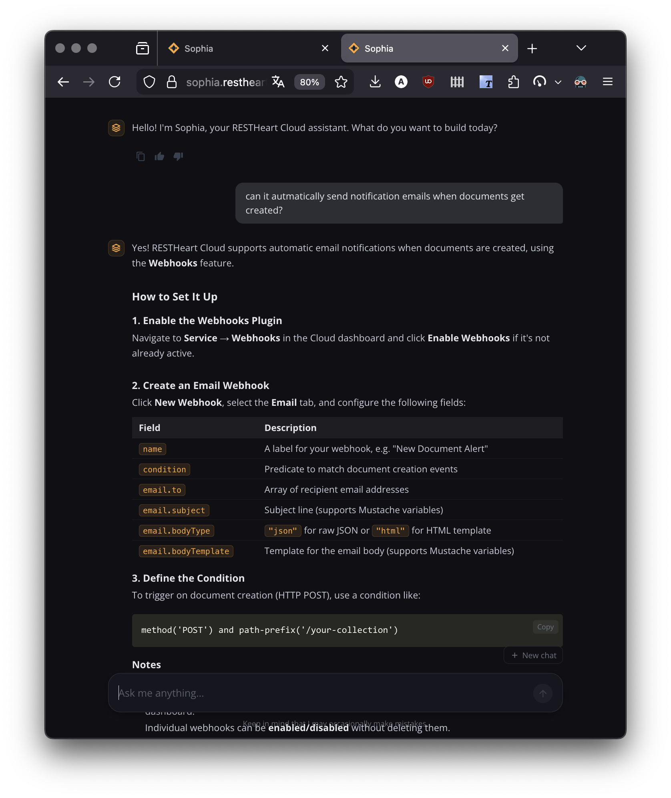
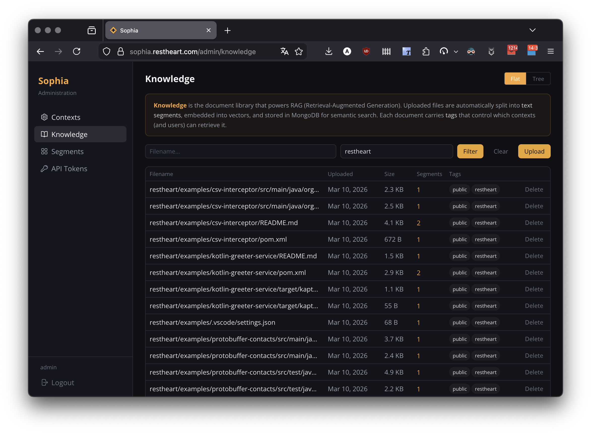
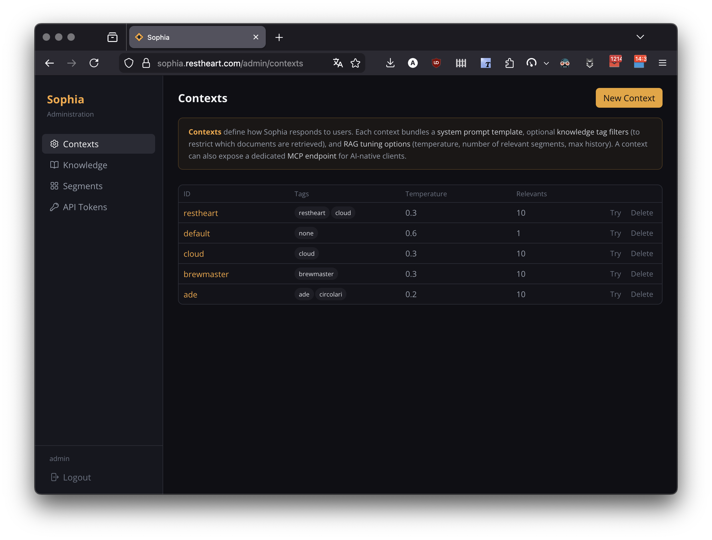
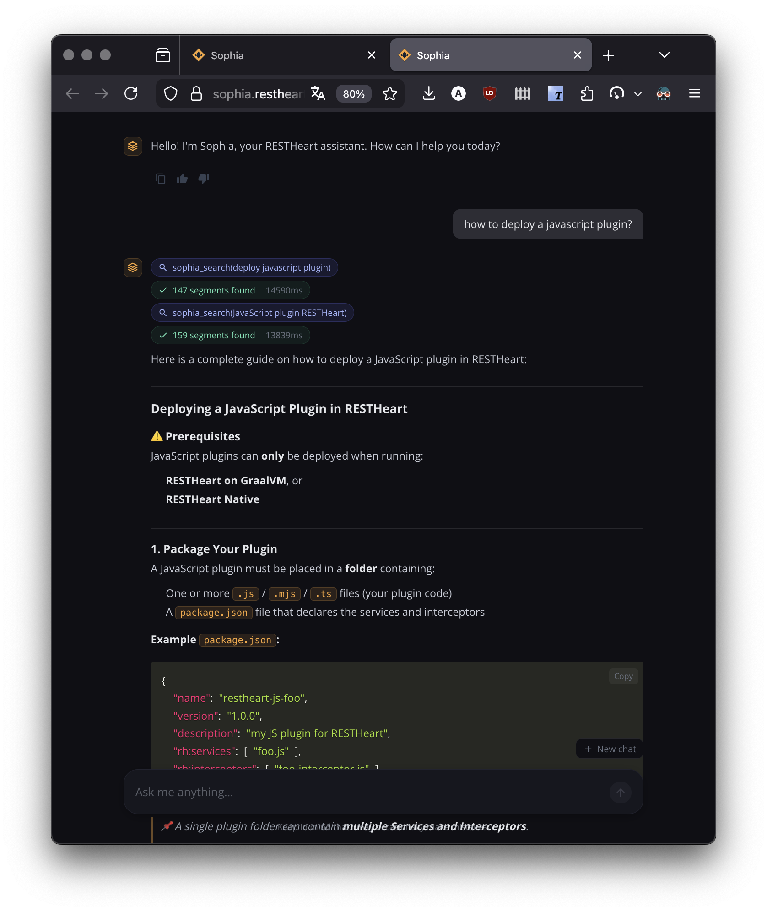

=== Intelligent AI Powered by Your Knowledge

Sophia is an AI assistant built by SoftInstigate that turns any knowledge base into an intelligent, conversational interface. It combines Claude (Anthropic's advanced language model) with Retrieval-Augmented Generation (RAG) to provide instant, accurate answers grounded in your documents.

=== Sophia for RESTHeart

If you're here to learn about RESTHeart or RESTHeart Cloud, Sophia is already working for you. The link:/docs/sophia[AI Help] in the top navigation connects you to a Sophia instance trained on the full RESTHeart documentation — including plugin API, configuration guides, and source code examples. You can also connect it to Claude Desktop, Cursor, or VS Code via MCP (see link:/docs/cloud/sophia/mcp[MCP Server]).

=== Sophia for Your Organization

Sophia is available as a *managed service* through *RESTHeart Cloud* (dedicated tier) or as an *on-premises deployment* on your own infrastructure. Either way, you get your own Sophia instance, powered by your own knowledge base — with full control over contexts, documents, access, and AI behaviour through the admin panel.

Upload your documents, configure your contexts, and your users get an intelligent assistant that understands your content. Customer support teams, educational institutions, and enterprise organizations use Sophia to make their knowledge instantly accessible.

image::../../../images/sophia/admin-panel.png[Admin panel]

=== Key Features

==== Knowledge Base Management

Upload documents in multiple formats (PDF, Markdown, HTML, plain text). Sophia automatically processes them into searchable segments with vector embeddings. The admin panel provides intuitive tools for uploading, browsing, and managing your knowledge base.

==== Contexts and Knowledge Segregation

Organize your knowledge into isolated *contexts*, each with its own prompt template, document tags, and RAG configuration. Contexts ensure strict data separation — users in one context can never access documents from another. Serve different audiences (customers, internal staff, partners) from a single Sophia instance.

==== Agentic Mode

For complex questions, Sophia can operate as an autonomous agent. When agentic mode is enabled, Sophia iteratively searches the knowledge base, reads files, and reasons about the results before composing a comprehensive answer. Users see the reasoning process in real time.

==== Security and Access Control

Cookie-based authentication secures the web interface, while JWT tokens provide programmatic access for APIs and MCP clients. API tokens can be scoped to specific contexts and tags, ensuring knowledge segregation extends to every access path.

==== MCP Server

Sophia exposes a *Model Context Protocol (MCP) server*, allowing AI clients such as Claude Desktop, Cursor, and VS Code to connect directly to your knowledge base. The admin panel generates ready-to-paste configuration snippets.

image::../../../images/sophia/token-mcp-config.png[MCP configuration]

See link:/docs/cloud/sophia/mcp[Sophia MCP Server] for setup instructions.

==== Flexible Integration

The responsive chat interface works across devices and can be embedded into existing websites via iframe. Multi-language support (English/Italian) and customizable themes let Sophia match your brand.

=== Getting Started

See the link:/docs/cloud/sophia/setup[Setup Guide] to get your own Sophia instance.
