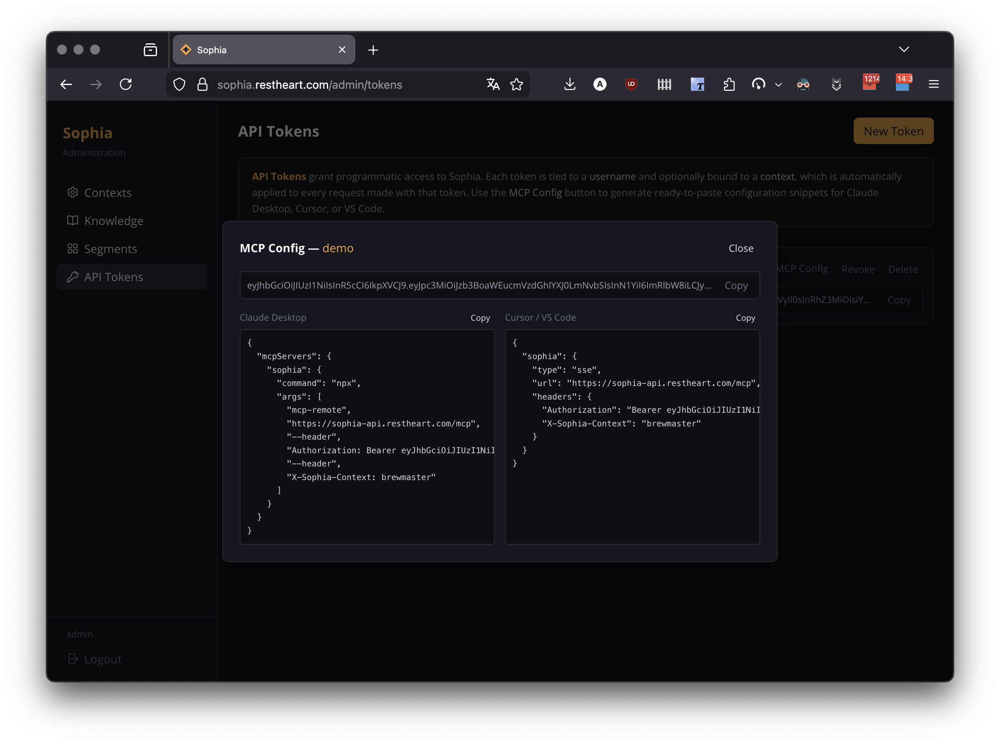

Every Sophia instance exposes an link:https://modelcontextprotocol.io[MCP-compatible] server, allowing any AI client to query its knowledge base directly — without going through the chat UI or the REST API.

== What the MCP Server Exposes

Sophia organises its knowledge into *Contexts*. Each context defines an isolated knowledge domain with its own:

- *documents* — files ingested into the knowledge base, tagged for access control
- *system prompt template* — how the AI frames its answers
- *RAG options* — how many documents to retrieve and inject into the prompt
- *MCP description* — the text shown to AI clients when they list available tools

Each context is accessible at its own MCP endpoint: `<base-url>/mcp/<context-id>/`. When an AI client connects to that endpoint, it can use the Sophia tools to search and retrieve content *scoped to that context only*. A client connected to the `restheart` context cannot read documents that belong to the `cloud` context, and vice versa.

Within a context, documents are further organised by *tags*. Pass the optional `tags` parameter to `sophia_search` to narrow retrieval to documents carrying specific tags. Use `sophia_list_tags` to discover which tags are available.

For more on contexts, see the link:/docs/cloud/sophia/administrator-guide#_context_management[Administrator Guide].

== SoftInstigate Public MCP Servers

SoftInstigate runs two public Sophia instances as live examples — no account or token required:

[cols="1,2,2", options="header"]
|===
| Context | Endpoint | Knowledge base
| `restheart` | `https://sophia-api.restheart.com/mcp/restheart/` | RESTHeart documentation, plugin API, configuration guides
| `cloud` | `https://sophia-api.restheart.com/mcp/cloud/` | RESTHeart Cloud managed service docs
|===

These are fully functional Sophia deployments managed by SoftInstigate. You can use them directly in your AI client or as a reference when setting up your own instance via link:/docs/cloud[RESTHeart Cloud].

To connect immediately with Claude Desktop, open *Settings → Connectors → Add custom connector* and paste the URL. Or add this to `claude_desktop_config.json`:

[source,json]
----
{
  "mcpServers": {
    "sophia-restheart": {
      "type": "sse",
      "url": "https://sophia-api.restheart.com/mcp/restheart/"
    }
  }
}
----

== Authenticated Access

Private knowledge bases require an API token. Issue one from the admin panel (see link:/docs/cloud/sophia/administrator-guide#_api_token_management[API Token Management]). The admin panel generates ready-to-paste MCP configuration snippets for each token.

The token can be passed as an `Authorization: Bearer <token>` header or, for clients that do not support custom headers, as a `?token=<jwt>` query parameter:

`https://<your-sophia>/mcp/<context>/?token=<your-token>`

== Configuration Examples

=== Clients with native HTTP/SSE support

Clients that connect directly over HTTP (Claude Desktop, Cursor) use the context URL with an optional `Authorization` header.

*Claude Desktop* — the easiest way is via the UI: open *Settings → Connectors → Add custom connector* and paste the context URL. For private contexts, Claude Desktop will prompt for OAuth client credentials, which Sophia supports natively.

To configure via `claude_desktop_config.json` (`~/Library/Application Support/Claude/` on macOS, `%APPDATA%\Claude\` on Windows):

[source,json]
----
{
  "mcpServers": {
    "sophia": {
      "type": "sse",
      "url": "https://<your-sophia>/mcp/<context>/",
      "headers": {
        "Authorization": "Bearer <your-token>"
      }
    }
  }
}
----

Restart Claude Desktop after editing the file.

*Cursor* — add to `.cursor/mcp.json`:

[source,json]
----
{
  "sophia": {
    "type": "sse",
    "url": "https://<your-sophia>/mcp/<context>/",
    "headers": {
      "Authorization": "Bearer <your-token>"
    }
  }
}
----

=== Clients that support stdio only

Some clients (Claude Code, Zed, VS Code) spawn MCP servers as local processes and communicate over stdio. Use link:https://www.npmjs.com/package/mcp-remote[`mcp-remote`] as a bridge — it connects to the HTTP endpoint and exposes it as a stdio process. It requires link:https://nodejs.org[Node.js >= 18] and is downloaded automatically by `npx` on first run.

For authenticated access with stdio clients, pass the token via the `?token=` query parameter since stdio bridges typically do not support injecting headers.

*Claude Code* — add to `.mcp.json` in your project root or to the global MCP config:

[source,json]
----
{
  "mcpServers": {
    "sophia": {
      "command": "npx",
      "args": ["mcp-remote", "https://<your-sophia>/mcp/<context>/?token=<your-token>"]
    }
  }
}
----

*Zed* — add to `.zed/settings.json`:

[source,json]
----
{
  "context_servers": {
    "sophia": {
      "command": "npx",
      "args": ["mcp-remote", "https://<your-sophia>/mcp/<context>/?token=<your-token>"]
    }
  }
}
----

== Available Tools

[cols="1,3", options="header"]
|===
| Tool | Description
| `sophia_search` | Semantic search over the knowledge base. Returns relevant text segments with `Source:` filename and `Path:` directory for context expansion.
| `sophia_get_file` | Retrieves the full content of a document by filename (all chunks merged in order). Use after `sophia_search` to read beyond the matched chunk.
| `sophia_list_files` | Lists all accessible documents with tags and chunk count. Accepts an optional `path` parameter to filter by directory.
| `sophia_list_tags` | Lists the tags available in the knowledge base, filtered by the active context and credentials.
| `sophia_list_paths` | Lists immediate subdirectories under a given path prefix, like `ls`. Without arguments, returns top-level directories.
| `sophia_render_prompt` | Builds a fully interpolated system prompt with RAG context injected, ready to send to any LLM as a `system` + `user` message pair.
| `sophia_api` | Returns the complete Sophia REST API reference. Requires authentication — reserved for service administrators.
|===

== Recommended Tool-Chaining Workflow

To maximise the context available to an AI agent:

. *`sophia_search`* — find relevant chunks; note the `Source:` filename and `Path:` directory in each result.
. *`sophia_get_file`* — retrieve the full file from `Source:` (not just the matched chunk).
. *`sophia_list_files`* with `path=<Path:>` — discover all related files in the same directory.
. *`sophia_get_file`* — retrieve any relevant sibling files.

To explore the knowledge base structure before searching:

[source]
----
sophia_list_paths          → top-level directories
sophia_list_paths(path=X)  → subdirectories under X
sophia_list_files(path=X)  → files in directory X
sophia_list_tags           → available tags
----
