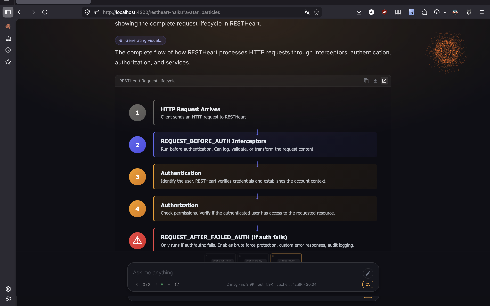
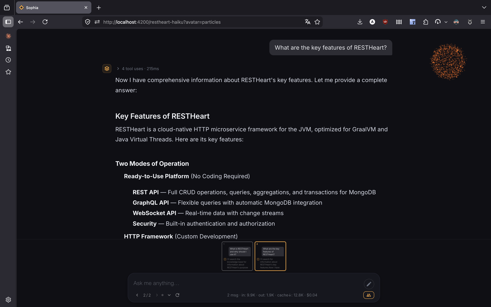

There are three ways to interact with Sophia.

== Getting Access

Sophia accounts are *invitation-only*: there is no self-service signup. An administrator from your organisation creates the account for you, and you receive an *invitation email* at the address they entered.

The email contains a single activation link of the form:

[source]
----
https://<your-sophia-host>/auth/activate?email=<your-email>&token=<...>
----

Open the link in your browser. The activation page asks you to:

. *Choose a password.* Re-type it in the confirmation field. The server rejects weak passwords (zxcvbn score < 3) — pick a passphrase or a long, varied password.
. *Accept the Terms of Service* (a link opens the document on `restheart.com` in a new tab).
. *Accept the Privacy Policy* (same).
. *Specifically approve* the clauses listed in §13.5 of the Terms — under Italian law (art. 1341 c.c.) these clauses require separate written approval.

All three checkboxes must be ticked before the *Activate my account* button enables. Click it and Sophia logs you in automatically and redirects to the main interface (chat for `user`, admin panel for `admin` / `tenant-admin`).

A few details to keep in mind:

- The activation link is *single-use* and expires 7 days after it is sent. If it expires (or you lose the email), ask your administrator for a new invitation.
- Until you complete activation, the account is `invited` and *cannot log in* via the regular login page — only the activation link works.
- If the link looks broken because of an ad-blocker (it may show `awstrack.me` as a tracking host), disable the blocker for that domain or copy the link and open it directly.

After activation you can change your password and review your accepted policies anytime from the link:#your-profile[Profile] page.

== Web Chat Interface

The simplest way to use Sophia is through the web chat interface. Navigate to the URL provided by your administrator, type your question, and get an instant response powered by your organization's knowledge base.

image::../../../images/sophia/chat-interface.png[Chat interface]

Sophia streams responses in real time, supports follow-up questions, and formats answers with rich text, code blocks, and links.

=== Hint Questions

When the context defines them, the chat opens with a row of clickable chips — common starting questions chosen by your administrator. Click one to send it as your first prompt; ignore them and type your own at any time.

=== Agentic Mode

When *Agentic Mode* is enabled on the agent, Sophia autonomously searches and reads multiple documents before answering. You'll see a real-time timeline of tool executions — each step is a badge with the tool name, arguments, and a result summary; click to expand for the full payload. Total iterations and per-iteration token usage appear at the bottom of the answer.

image::../../../images/sophia/agentic-response.png[Agentic response]

=== Collaborative Artifacts

If the context has *Collaborative Mode* on, Sophia can render rich interactive HTML artifacts directly in the chat — diagrams, calculators, mini-dashboards, REST micro-tools — and attach 2–4 follow-up button suggestions after each answer. You can also activate Collaborative Mode for a single message via the per-message toggle even when the agent default is off.

To share a generated artifact with someone else (read-only, no login required), use the *Share* button on the artifact card — it produces a URL that returns only the artifact, scoped to that single interaction.

=== Deck View

Some contexts use *Deck View* — the chat is presented as a horizontal deck of cards instead of a vertical scroll. Navigate with the arrow buttons or swipe; each card holds prompt above and answer below. Useful for guided tours, lesson decks, and demo flows.

=== Embedding

The chat interface supports multiple languages (English/Italian), customisable themes, and can be embedded into existing websites via iframe. Ask your administrator for the embed URL.

== MCP Server

Connect your favourite AI client directly to your Sophia knowledge base via the *Model Context Protocol (MCP)*. Supported clients include Claude Desktop, Cursor, Claude Code, and VS Code.

Your administrator can generate ready-to-paste configuration snippets from the admin panel.

See link:/docs/cloud/sophia/mcp[Sophia MCP Server] for full setup instructions, including OAuth and API-token authentication for private agents.

== REST API

For programmatic access, Sophia exposes a full REST API for chat operations, document management, and semantic search.

See link:/docs/cloud/sophia/api-documentation[API Documentation] for endpoint reference and code samples.

[[your-profile]]
== Your Profile

Once logged in, click the avatar at the top-right of the chat (or the *Profile* link in the admin sidebar) to reach `/profile` — your personal account page. It groups everything you can manage about your own account:

- *Account* — read-only view of your email, tenant, roles and member-since date
- *Accessible Agents* — list of every agent you can chat with, marked `public` or `private`
- *Change Password* — change your password; you'll be asked to re-enter your current one as a confirmation. The new password is validated by the server (rejected if too weak)
- *Accepted Policies* — version, date and link of the Terms, Privacy and Cookie documents you accepted. When a newer major version exists, the *Update acceptance* button opens the same modal you saw at activation. A *Refresh* button checks for new versions on the server without reloading the page.
- *Session* — the *Logout* button. Closing the tab also ends your session when the cookie expires (typically 8 hours)

The *← Back* button at the top-left of the profile page returns you to wherever you came from — the chat agent, the admin section, or any other page in Sophia — so you don't lose your place. If you open `/profile` directly (e.g. via a bookmark), Back falls back to your role's home page.

== Legal Documents

Three small links are pinned at the bottom-right of every page: *Terms · Privacy · Cookies*. They open the corresponding documents on `restheart.com` in a new tab. They are visible to both logged-in and anonymous users.

The first time you log in (and after any major-version update of the Terms or Privacy Policy) Sophia displays a blocking modal asking you to:

. Accept the *Terms of Service* (link to the document)
. Accept the *Privacy Policy* (link to the document)
. Specifically approve the clauses listed in §13.5 of the Terms — under Italian law (art. 1341 c.c.) these clauses require separate written approval

You cannot use the service without accepting. The only escape is the *Logout* button in the modal. Sophia records the version and URL of each accepted document, along with timestamp and IP address, as evidence of consent.
