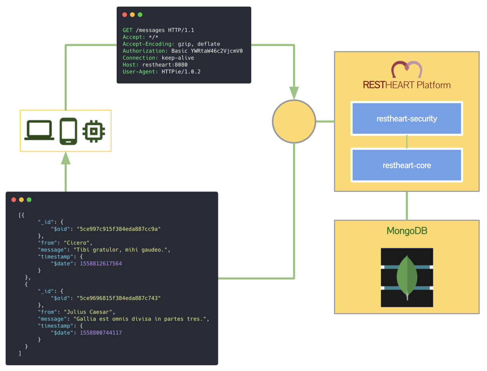

# REST API for MongoDB

<hr width="100%">

RESTHeart unlocks all the features of __MongoDB__ via __HTTP__. 

 - Queries
 - Bulk Updates
 - GridFs
 - Aggregations
 - Map-reduce functions
 - Replica Sets
 - Shards
 - Indexing
 - And many more...

Are all accessible via a simple __REST API__.

```javascript
const url = encodeURI('https://beta.mrest.io/demo/messages?filter={"from":"Bob"}&pagesize=2');

fetch(url, { headers: {'key':'demo'} })
  .then(response => response.json())
  .then(function(data) {
    console.log(JSON.stringify(data));
});
```

__No server-side development__ is required so you can focus on building your __Web__ or __Mobile apps__ or Enterprise Integration System, as all the database logic is available out of the box.

RESTHeart also provides strong API & Web __Security models__ for User Authentication, Authorization and Caching.

{: width="70%" height="auto" class="img-fluid mx-auto d-block"}

<hr width="90%">

{: .text-center }
## What is MongoDB?

MongoDB is a cross-platform document-oriented database program. Classified as a NoSQL database program, MongoDB uses JSON-like documents with schema. MongoDB is developed by MongoDB Inc. and licensed under the Server Side Public License (SSPL).

[{: width="30%" height="auto" class="img-fluid mx-auto d-block"}](https://www.mongodb.com)
